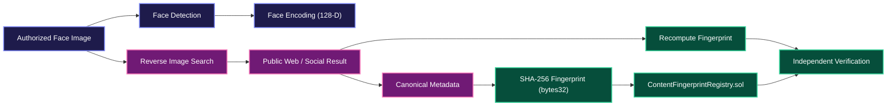

# FaceChain Verify: System Architecture & Technical Specification

FaceChain Verify is a decentralized biometric evidence verification protocol. It bridges computer vision, genuine web & reverse-image discovery, deterministic metadata canonicalization, and smart contract verification on Ethereum-compatible blockchains.

---

## 1. System Pipeline Architecture



---

## 2. Core Architectural Principles & Distinctions

| Stage | Operation | What It Accomplishes | What It NEVER Claims |
| :--- | :--- | :--- | :--- |
| **Face Detection** | Multi-tier cascade & contour detector | Confirms presence of a usable face, dimensions, and bounding boxes. | Does **NOT** identify an unknown person by name. |
| **Face Encoding** | 128-D normalized spatial moment vector | Temporary mathematical representation for computer vision quality checks. | Does **NOT** match against a person database or persist biometrics. |
| **Reverse Search** | Live multi-provider image search (SerpApi, Bing, RapidAPI) | Discovers visually similar indexed public web and social media posts. | Does **NOT** claim account ownership or prove person identity. |
| **Content Fingerprint** | Deterministic JSON serialization + SHA-256 | Creates a tamper-evident cryptographic fingerprint (`bytes32`). | Does **NOT** hash volatile or non-deterministic properties. |
| **Blockchain Registry** | `ContentFingerprintRegistry.sol` smart contract | Stores an immutable record of the fingerprint, source URL, timestamp, and submitter. | Does **NOT** store face images or biometric embeddings on-chain. |
| **Re-Verification** | Independent on-chain state query & hash comparison | Confirms whether provided metadata matches the immutable on-chain record (`VERIFIED` vs `MISMATCH`). | Does **NOT** assert real-world identity from a hash alone. |

---

## 3. Component Architecture

### 3.1 Frontend (Client Layer)
- **Framework**: React 18, TypeScript, Vite, Tailwind CSS.
- **Components**:
  - `Dashboard`: 7-step pipeline execution, image preview, progress stepper, and dynamic card layout.
  - `ImageUploader`: Drag-and-drop zone with instant local synthetic face generator fallback.
  - `FaceDetectionCard`: Canvas bounding box renderer, face count, quality metrics, and embedding dimension display.
  - `ReverseSearchCard`: Live web discovery card with "Use for Blockchain Record" confirmation modal.
  - `BlockchainCard`: Transaction hash, block height, contract address, and copy-to-clipboard utilities.
  - `TamperTester`: Interactive laboratory allowing developers to edit evidence fields and witness real-time on-chain mismatch detection.
  - `VerificationBadge`: Real-time cryptographic validation badge (`VERIFIED` vs `MISMATCH`).

### 3.2 Backend (API & Processing Layer)
- **Framework**: FastAPI (Python 3.13), Uvicorn, Pydantic v2.
- **Services**:
  - `FaceService`: Multi-cascade OpenCV detector, 128-D normalized embedding vector extractor, quality estimator.
  - `ReverseSearchService`: Multi-provider abstraction supporting SerpApi (Google Lens), Bing Visual Search, RapidAPI, and labeled Demo Mode fallback.
  - `FingerprintService`: Deterministic JSON canonicalizer and SHA-256 hasher.
  - `BlockchainService`: Web3.py provider connecting to local Hardhat nodes or Ethereum testnets (Polygon Amoy).
  - `VerificationService`: Independent verification coordinator.

### 3.3 Blockchain (Smart Contract Layer)
- **Smart Contract**: `ContentFingerprintRegistry.sol` (Solidity 0.8.20).
- **Storage Model**:
  ```solidity
  struct VerificationRecord {
      bytes32 fingerprint;   // SHA-256 hash of canonical discovered metadata JSON
      string sourceUrl;      // Actual discovered public web/social URL
      uint256 timestamp;     // Block timestamp when registered
      address submitter;     // Ethereum address that registered the fingerprint
  }
  mapping(bytes32 => VerificationRecord) public records;
  ```
- **Methods**:
  - `registerFingerprint(bytes32 fingerprint, string calldata sourceUrl)`: Registers record and emits `FingerprintRegistered` event.
  - `verifyFingerprint(bytes32 fingerprint)`: Returns `(bool exists, uint256 timestamp, string memory sourceUrl, address submitter)`.
  - `getRecord(bytes32 fingerprint)`: Fetches record by hash.
  - `getRecordByIndex(uint256 index)`: Fetches record by numerical index.

---

## 4. Privacy & Security Model
1. **Zero Biometric Exposure**: Raw face images and biometric embeddings are **never** committed to disk permanently and **never** placed on-chain.
2. **Ephemeral Processing**: Uploaded images are held in memory during the pipeline run and purged automatically.
3. **No Database of Individuals**: The system performs no face-recognition lookup against databases of citizens or users.
4. **Tamper-Evident Integrity**: Any alteration in discovered metadata (even 1 character) changes the resulting SHA-256 hash, causing immediate `MISMATCH` during blockchain verification.
